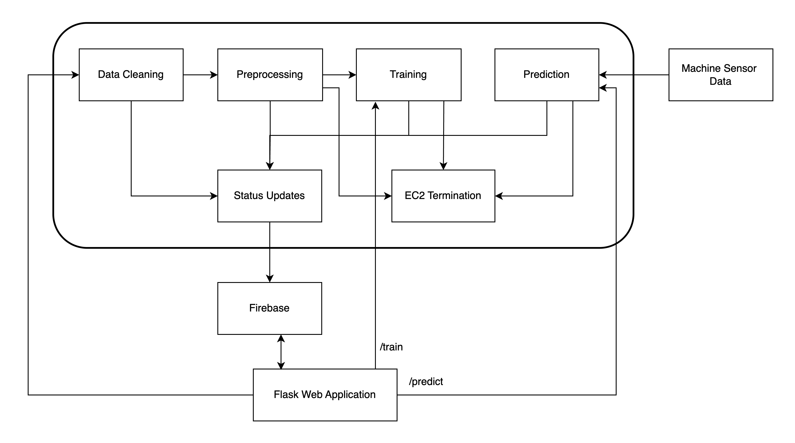
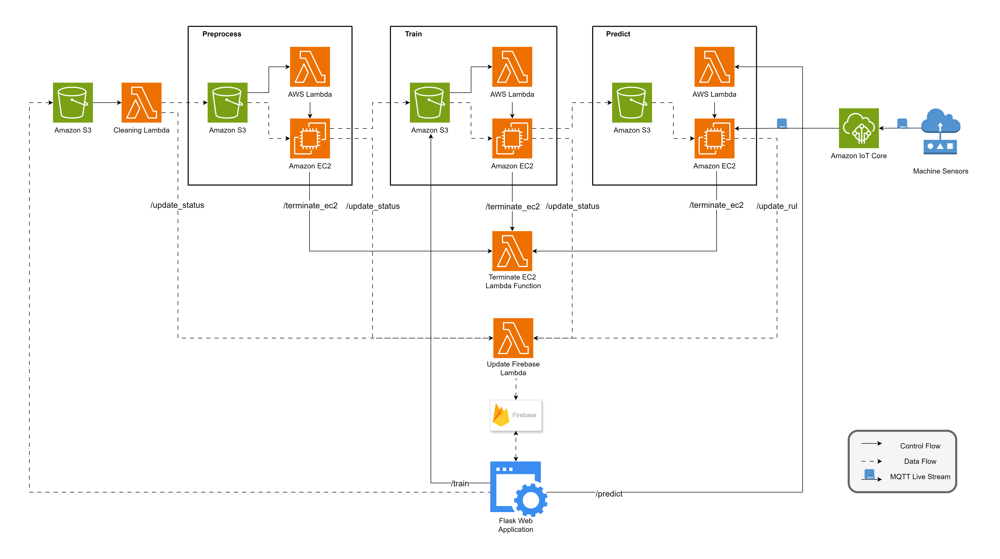

# AUTO-MAINT: A Serverless Automated MLOps Framework

**AUTO-MAINT** is a fully automated, cloud-based platform designed to democratize **Predictive Maintenance (PdM)** for Micro, Small, and Medium Enterprises (MSMEs). By leveraging a serverless microservices architecture on AWS, the framework simplifies the implementation of Machine Learning (ML) models, significantly reducing the technical expertise and capital investment traditionally required for industrial equipment monitoring.

## 🚀 Key Features
* **Serverless MLOps Pipeline**: Fully automated data cleaning, feature engineering, model training, and deployment utilizing AWS Lambda and EC2.
* **Real-Time Predictions**: Employs MQTT streams for near-instantaneous Remaining Useful Life (RUL) estimation with latency under 1 second.
* **High Accuracy**: Features the **GLD Stack** (GRU, LSTM, and Dense layers), achieving an $R^2$ score of over 0.99 across industrial datasets.
* **Cost-Effective**: Designed to operate on a minimal budget; the entire experimentation phase cost less than **$50**.
* **Dual-Mode Interface**: A Flask-based web dashboard supports both novice users through automated templates and advanced users via custom code uploads.

---

## 🏗️ System Architecture
The platform utilizes a microservices paradigm to ensure independent scalability for each stage of the predictive maintenance workflow:

1. **Data Ingestion**: Users upload machine sensor datasets to **AWS S3** via the web interface.
2. **Automated Cleaning**: An **AWS Lambda** function removes noise, handles missing values (dropping columns with >50% missing data), and standardizes terminology.
3. **Feature Engineering**: **EC2 instances** generate lagged features, calculate anomaly scores using Isolation Forest, and perform KMeans clustering.
4. **Model Training**: Supports templates including LSTM, XGBoost, Random Forest, and custom stacked ensembles, with automated hyperparameter tuning via Optuna.
5. **Live Inference**: **AWS IoT Core** manages unique MQTT topics for real-time sensor data streaming and RUL dashboard updates.

---

## 📊 Model Performance & Efficiency
Our research validated the framework using the NASA Turbofan Jet Engine and Lithium-ion Battery datasets.

### **Prediction Accuracy**
The **GLD Stack** consistently outperformed traditional regression and ensemble methods.

| Model Template | $R^{2}$ Score (NASA FD001) | MAE (NASA FD001) | MSE (NASA FD001) |
| :--- | :--- | :--- | :--- |
| **GLD Stack** | **0.99011** | **4.736** | **42.455** |
| LSTM | 0.79472 | 20.290 | 581.144 |
| XGBoost | 0.56987 | 32.871 | 1984.818 |
| SVR | 0.55765 | 32.406 | 2041.204 |

### **Training Efficiency**
Training times remain computationally feasible even for complex architectures.

| Model Template | Training Time (20k rows) |
| :--- | :--- |
| **LSTM (1 iteration)** | **5 minutes** |
| LightGBM (50 iterations) | 6 minutes |
| Stacking Ensemble | 16 minutes |
| GLD Stack (27 permutations) | 270 minutes |

---

## 🛠️ Tech Stack
* **Cloud Infrastructure**: AWS (Lambda, S3, EC2, IoT Core)
* **Web Framework**: Python, Flask 
* **Database**: Firebase / Firestore 
* **Machine Learning**: TensorFlow/Keras (LSTMs, GRUs), Scikit-Learn, Optuna 
* **Communication**: MQTT Protocol 

---

## 📖 Citation
If you use this code or framework in your research, please cite our paper:

> Acharya V., Saketh V.N., Zaki A. et al. **A serverless automated MLOps framework for scalable industrial predictive maintenance**. *Discov Internet Things* (2026). https://doi.org/10.1007/s43926-026-00291-0

---

## 🤝 Contributors
* **Vadiraja Acharya** – Original Concept & Guidance 
* **V. Naga Saketh** – Architecture Design & ML Implementation 
* **Adnan Zaki** – Frontend User Interface 
* **M. Manas Gowda** – AWS Deployment & Firebase Setup 
* **Naitik Jain** – Machine Learning & Literature Survey 
* **Prasad B. Honnavalli** – Project Management & Funding 
